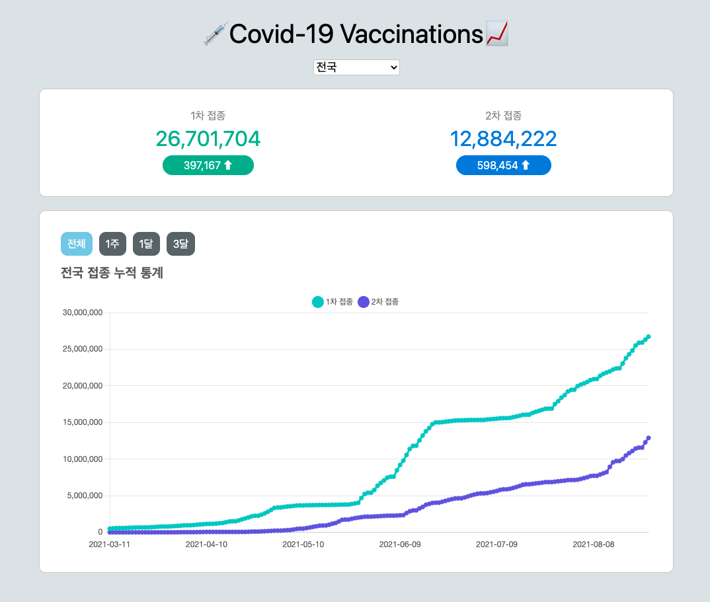

## 사이드 프로젝트

간단한 사이드 프로젝트로 코로나 백신접종 현황을 그래프로 볼 수 있는 사이트을 만들어 보기로 했고,
만든 과정을 가볍게 정리해보려고 합니다.

  

## 준비

CRA으로 간단하게 시작했고, 백신접종현황은 공공데이터포털에서 제공하는 API를 이용했습니다.
그래프를 그리기 위해 Chart.js를 이용했습니다.
처음에는 D3.js를 이용해 국가 지도를 그려 그 위에 현황을 나타내보고 싶었는데 geojson을 가지고 지도를 그려내는데 생긴 문제를 해결하지 못했고, 선형 그래프로 계획을 바꿨습니다.

물론 D3.js를 이용해서도 선형그래프를 그릴 수는 있는데도 Chart.js로 바꾼 이유는 첫째로 D3 공식문서를 이해하기 어려웠기 때문입니다...
영어를 그닥 잘하는 편이 아니기때문에 번역된 내용과 원문을 오가며 읽는 편인데, 다양한 예시들이 있었지만 Javascript notebook(Jupyter notebook의 JS버전 같아보였던)에 작성되어있었고
이 때문인지 번역기가 제대로 먹지않는 문제가 있었습니다.

두번째로 관련 내용의 블로그나 유튜브 위주로 찾아보았는데 대다수가 3버전의 내용이었습니다. 그리고 지금 D3는 7버전...😵

개발기간의 대다수를 위 문제를 해결하기위해 썼지만, 이해하지 못하면 다음으로 넘어가질 못해서 프로젝트를 시작도 못한채 밀리고 있는데다가
지도를 그리려는데 계속해서 발생하는 에러의 원인이 단순히 무언가 잘못쓴 것인지, 버전의 차이인지 파악이 되지 않아서 결국 Chart.js로 바꾸며 동시에 선형그래프를 그리는걸로 결정했습니다.
물론 D3.js로도 가능하지만, 나중에 다시 도전해보는걸로...

## 설계

앞서 언급했듯 처음에는 D3.js를 이용해 한국지도를 그려내고 그 위에 지역별 백신 접종 현황을 보여주는 식으로 만들고싶었지만,
Chart.js로 변경한 후 보고싶은 지역을 선택하면 지역별 당일 접종 누적자 수와 특정 기간동안 접종자 그래프를 그려내는 방식으로 만들었습니다.

## React 성능 최적화

사실 프로젝트가 워낙 간단했기 때문에 개발 자체는 그리 오래걸리지 않았습니다.
Chart.js를 적용하며 문제가 있긴했지만, 그리 어렵진 않았어요.
그보다 그간 React 성능 최적화 문제를 어떻게 해결하는지 알지 못해 해당 부분을 배우고 적용해 보느라 프로젝트 완성이 늦어졌습니다.

대부분의 경우 memo를 적용해 해결했지만, 해당 페이지를 렌더링 할 때 제목 등 간단한 컴포넌트를 분리하지 않아서인지 memo로 해결이 되지 않아 useMemo를 사용하기도 했습니다. (사실 그닥 좋은 방법은 아닌것 같았지만)
그리고 styled-component를 사용했는데 Global Style 또는 Routes 컴포넌트도 memo를 사용해야하는지 여전히 고민이 됩니다.

## 느낀점

마지막으로 사실 나름대로 성능 최적화를 해보겠다고는 했지만 각각 별개의 컴포넌트에서 데이터를 이용하다보니 각각의 컴포넌트에서 api 요청을 하기보다
가장 상위의 부모 컴포넌트에서 State를 관리하다보니 여전히 불필요하게 렌더링 된다고 느꼈지더라구요.
한 번의 요청을 할 것인지, 여러번 요청을 하게 되더라도 각각의 컴포넌트에서 필요한 정보만 요청하는게 맞을지 고민되기도 했습니다.

State를 가장 상위 부모에서 관리하다보니 자식 컴포넌트에 불필요하게 전달하는 Props도 좀 있다고 느꼈는데
현재는 프로젝트 사이즈가 워낙 작아 굳이 수정하지 않았지만, 확장성을 고려한다거나 사이즈를 키우게 되면 각각의 컴포넌트에서 요청을 하는 방향으로 진행하거나,
Redux를 배워서 적용해보는게 좋겠다고 느꼈습니다.

마무리를 어떻게 해야할지 모르겠네요. Netlify로 배포를 마친 상태니 <a href="https://ki-covid.netlify.app/" target="_blank">링크</a>로 방문하셔서 한번 구경해보세요 급한 마무리 👋
